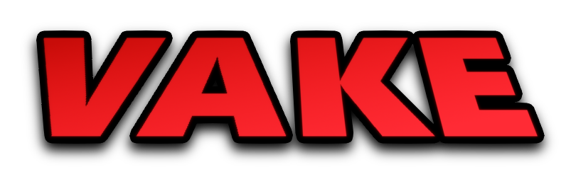

  

**Vake** is an unopinionated build system written in Rust to build and sync the In Silico project to Roblox Studio. It allows you to organize your Roblox projects in the file system without being confined to a specific organizational ideology. Project structures are defined in a `vakefile`, and can be used to describe any hierarchy model in Roblox Studio.